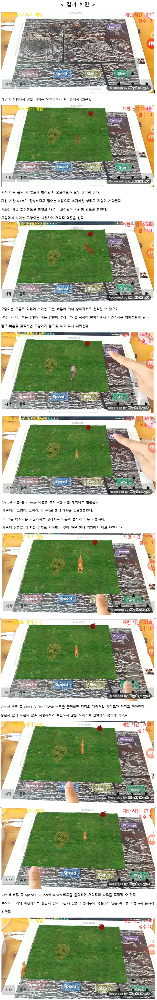
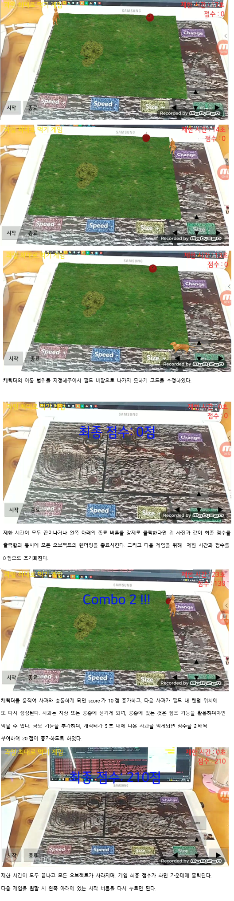

# 사과 먹기 게임 AR  ( 2019년도 1학기 )  

*  최종 프로젝트로 Android OpenCV, OpenGL, Vuforia AR 개발환경을 이용한 ‘사과 먹기 게임 AR 앱’을 개발  
*  안드로이드 앱을 제작해보면서 JAVA 언어 원리와 사용법을 이해  
*  Checker board, obj, Texture를 이용한 object 증강
*  Virtual Button, Display Button을 이용한 Object 동작 제어  
* 코드:
> Mobile-AR/VuforiaSamples-8-1-7/app/src/main/java/com/vuforia/engine/CoreSamples/app/VirtualButtons/VirtualButtons.java  
> Mobile-AR/VuforiaSamples-8-1-7/app/src/main/java/com/vuforia/engine/CoreSamples/app/VirtualButtons/VirtualButtonRenderer.java  
> Mobile-AR/VuforiaSamples-8-1-7/app/src/main/java/com/vuforia/engine/CoreSamples/app/ImageTargets/OBJLoader.java  
> Mobile-AR/VuforiaSamples-8-1-7/app/src/main/java/com/vuforia/engine/CoreSamples/app/ImageTargets/ImageTargets.java  
> Mobile-AR/VuforiaSamples-8-1-7/app/src/main/java/com/vuforia/engine/CoreSamples/app/ImageTargets/ImageTargetRenderer.java  
> Mobile-AR/VuforiaSamples-8-1-7/app/src/main/res/layout/camera_overlay.xml  

  

